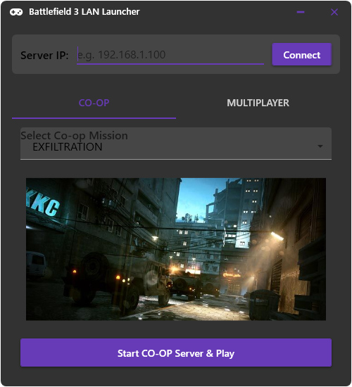
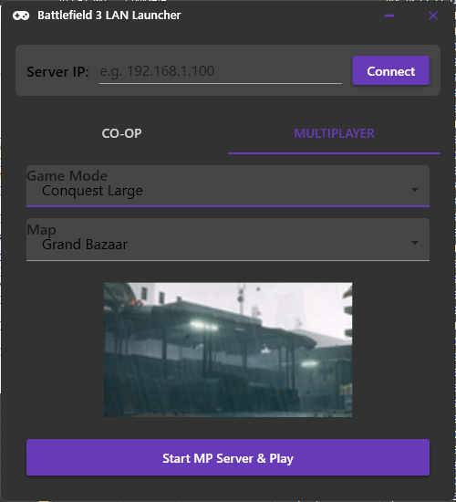

# Battlefield 3 LAN Launcher ReForged(not really)

[](LICENSE)
[](https://dotnet.microsoft.com/)

A modern, unified launcher for **Battlefield 3** that enables **LAN / VLAN co-op and multiplayer** – bypassing the broken official co-op matchmaking. Built with **.NET 10** and **WPF**, this tool combines two separate Chinese community launchers into one clean, translated, and improved application.

<table>
  <tr>
    <td></td>
    <td></td>
  </tr>
</table>
## ✨ Features

- 🎮 **One launcher for both Co-op and Multiplayer** – no more switching between two apps.
- 🌐 **LAN / VLAN play** – works over Hamachi, Radmin VPN, ZeroTier, or any direct Ethernet/WiFi.
- 🔧 **Modern .NET 10 + WPF** – fast, native Windows UI with full high-DPI support.
- 🌍 **English interface** – original Chinese tool fully translated and improved.
- 🚀 **Launch any co-op mission directly** 
- 🛡️ **No Origin/EA App required after setup** – just the patched game files.

---
## 🙏 Credits & Original Sources

This project would not exist without the incredible work of the Chinese modding community.

LINK to Original Project (probably) 
https://tieba.baidu.com/p/7105739665?lp=5028&mo_device=1&is_jingpost=0

I have simply **decompiled, translated, combined, and modernized** their work into a single .NET 10 WPF application. All credit for the underlying LAN-enabling patch goes to the original anonymous Chinese modders.

> 感谢中国BF3社区的所有人！(Thank you to the entire Chinese BF3 community!)

---
## ⚠️ Known Issues

### 🔥 Mission 3 ("EXFILTRATION") does not auto-launch

After completing the second co-op mission `FIRE FROM THE SKY`  the game **will not** automatically start the third mission (`EXFILTRATION`) when using this LAN launcher.

**Workaround:**  
Simply select `EXFILTRATION` manually from the launcher's co-op mission list and click "Launch". Your progress is still saved – this is purely a UI/game communication bug inherited from the original patch.

Other missions may have similar auto-progression issues. **Always use the launcher to explicitly start each co-op mission** for the most reliable experience.
### 🧪 Other minor quirks
- The in-game "Return to lobby" button may sometimes disconnect both players. Use the launcher to restart a mission instead.
- Firewalls must allow both `bf3.exe` and the launcher executable.
- Both players must use **exactly the same game version**
---

## 🚀 How to Use

### 1. Prerequisites

- Battlefield 3 with the **community LAN patch** applied (the one originally from Chinese sources, included in the `ybsp` archive).
- Both players on the same LAN or connected via a V-LAN tool (Radmin VPN, ZeroTier, Hamachi).
- .NET 10 Runtime (if not self-contained).

### 2. Installation

- Download the latest `BF3LANLauncher.zip` from [Releases](../../releases).
- Extract it in your BF3 game folder.
### 3. Playing Co-op

1. **Host:**  
   - Launch `BF3LanReforged.exe` → click **Co-op** tab.  
   - Select a mission → click **Start Server**.  
   - Wait for the game to launch.

2. **Client:**  
   - Launch the same launcher → **Co-op** tab.  
   - Enter the **host's LAN/VLAN IP address**.  
   - Click **Join** → game will launch and connect automatically.

### 4. Playing Multiplayer (LAN / VLAN)

- **Host:** Go to **Multiplayer** tab → set map, mode, slots → **Start Server**.  
- **Client:** Enter host IP → **Join**.

---
## 🛠️ Building from Source

- Requires Visual Studio 2022 (or newer) , VSCODE or  JetBrains Rider💖  with .NET 10 SDK.
- Clone the repo, open `BF3_LAN_Launcher.sln`, and build.

```bash
git clone https://github.com/yourusername/BF3-LAN-Launcher.git
cd src\BF3LanReforged
dotnet build -c Release
```

---

## 🤝 Contributing

Pull requests are welcome – especially for:
- Fixing the mission auto-progression bug.
- Adding more translations (Russian, Spanish, etc.).
- Improving VLAN detection.
- Adding Basic Server Configuration to Multiplayer
- Adding Basic Moderation to Multiplayer
- Adding Difficulty Selector to COOP

---

## 📜 License

MIT – feel free to use, modify, and share

---

## ❓ FAQ

**Q: Do I still need Origin/EA App?**  
A: No – after applying the original Chinese LAN patch, the game runs independently.

**Q: Can I play with someone using the original separate Chinese launcher?**  
A: Yes – the network protocol is identical. This is just a unified UI.

**Q: Does this work on Linux via Proton/Wine?**  
A: The launcher itself is Windows-only, but the patched BF3.exe can run under Wine. You'll need to test.

**Q: Why .NET 10?**  
A: it's fun.

**Q:**
A: yes this readme was created with the help of AI , i'm too lazy (no worries ,removed slops)
